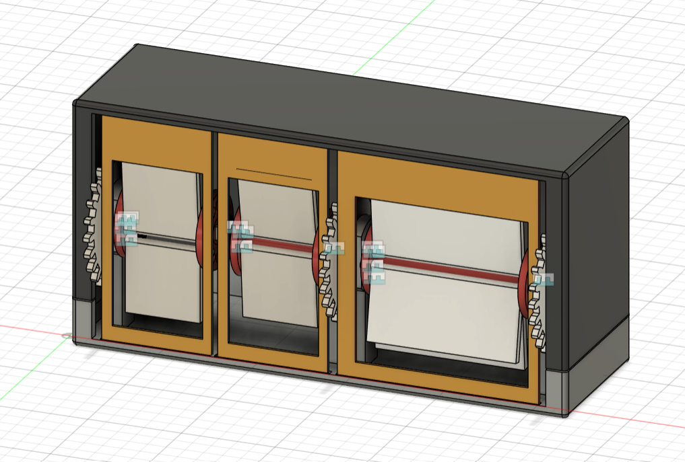
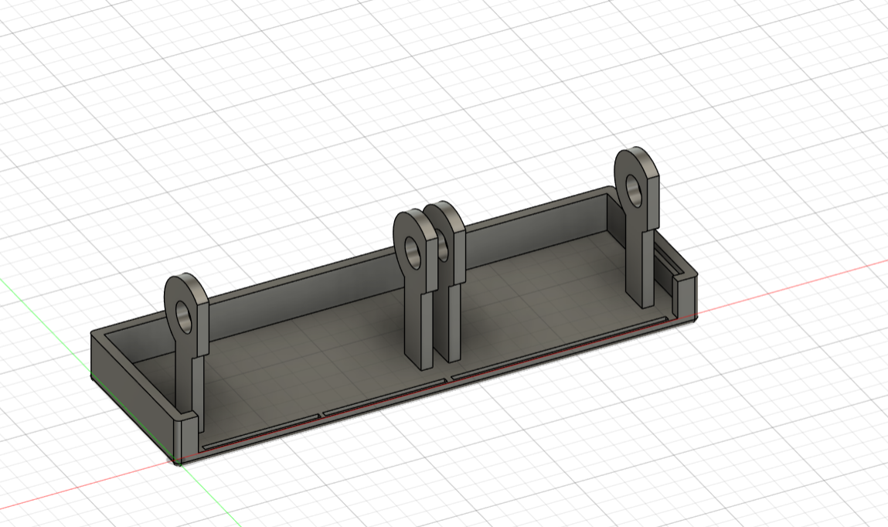
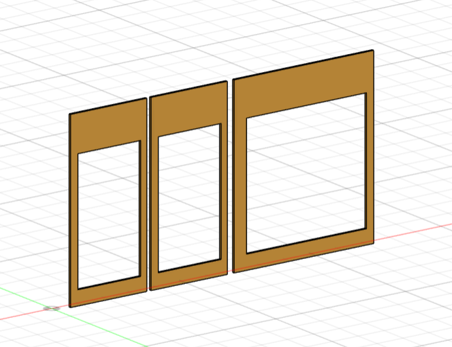

# Split-Flap Calendar Display – Fusion 360 Project

[](https://www.autodesk.com/products/fusion-360)
[](#)

A mechanically driven **3D-printable split-flap calendar display** modeled in **Autodesk Fusion 360**. The project uses a gear-driven mechanism to rotate numbered and dated flaps, creating a classic split-flap display effect commonly found in vintage clocks and information boards.

---

## Table of Contents

- [Project Overview](#project-overview)
  - [Key Features](#key-features)
  - [Photos](#photos)
- [Mechanical Architecture & Motion Flow](#mechanical-architecture--motion-flow)
  - [Gear Transmission](#1-gear-transmission)
  - [Flap Rotation](#2-flap-rotation)
  - [Date Display Update](#3-date-display-update)
- [Main Components](#main-components)
- [Assembly Structure](#assembly-structure)
- [File Inventory & Directory Structure](#file-inventory--directory-structure)
- [Requirements & Tools Needed](#️-requirements--tools-needed)

---

# Project Overview

This repository contains the CAD files, STL meshes, and assembly models for a **Split-Flap Calendar Display**.

The display consists of multiple rotating flap assemblies driven by a gear system. As the mechanism advances, the flaps flip sequentially to reveal the current date information. The design is intended to be fully 3D printable and easy to assemble.

The system uses a combination of large and small gears to synchronize movement between the flap assemblies while maintaining proper spacing and alignment through support structures and separation rings.

**Presentation Video:** [!! HERE !!](https://www.youtube.com/watch?v=V3hZJ-paj9w)
(I tried adding conctact sets for the flaps for a better simulation, but it did not work)

### Key Features

- **Fully 3D printable design**
- **Gear-driven flap mechanism**
- **Compact enclosed housing**
- **Modular assembly**
- **Support structures for smooth flap movement**
- **Easy maintenance and part replacement**
- **Designed in Autodesk Fusion 360**

---

## Photos

### Full Assembly

| Assembly View | Rendered View | Section View |
|---|---|
|  |  |  |

---

### Component Photos

| Component | Photo |
|------------|------------|
| Small Gear |  |
| Big Gear |  |
| Small Flap |  |
| Big Flap |  |
| Small Separation Ring |  |
| Small Flap Support |  |
| Big Flap Support |  |
| Base Box |  |
| Top Box |  |
| Side Wall |  |

---

### Prototypes

| Prototypes | Photo |
|------------|------------|
| 1st |  |
| 2nd |  |

---

### Alternatiove Design

| Alternatiove Design | Photo |
|------------|------------|
| Alternatiove Design for Base |  |

---

# Mechanical Architecture & Motion Flow

The calendar display operates through a simple gear-driven mechanism that rotates flap assemblies in sequence.

```text
          [Input Rotation]
                  │
                  ▼
               [Gear]
                  │
                  ▼
            [Flap Suport]
                  │
                  ▼
            [Flap Moves]
                  │
                  ▼
       [Updated Calendar Display]
```

## 1. Gear Transmission

The mechanism uses separate gear-driven assemblies to control the calendar display.

- A **big gear** drives the month display mechanism.
- Two **small gears** drive the day display mechanisms, one for each digit of the date.

The gear system provides controlled rotational movement, allowing the flaps to advance accurately between display positions.

## 2. Flap Rotation

Each gear is connected to a flap assembly through its corresponding support structure:

```text
[Big Flap]  ←→  [Big Flap Support]  ←→  [Big Gear]

[Small Flap]  ←→  [Small Flap Support]  ←→  [Small Gear]

[Small Flap] ←→  [Small Flap Support]  ←→  [Small Gear]
```

As the gears rotate:

- the first small flap updates the tens digit of the day;
- the second small flap updates the units digit of the day;
- the big flap updates the displayed month;
- the visible calendar information changes accordingly.

The flap supports maintain alignment and ensure smooth rotation, while the separation rings provide spacing between moving components and prevent interference during operation.

## 3. Date Display Update

Each rotation step moves the flaps to reveal the next calendar value.

The support structures guide the flaps and maintain alignment, ensuring smooth operation and consistent positioning throughout the display cycle.

---

# Main Components

| Component | Description |
|------------|------------|
| Small Gear | Drives one of the day-digit flap assemblies and controls the advancement of a small flap. |
| Big Gear | Drives the month flap assembly and controls the advancement of the month display. |
| Small Flap | Rotating display flap used for one digit of the day. Two identical small flap assemblies are used to display the full date. |
| Big Flap | Rotating display flap used to display the current month. |
| Small Separation Ring | Maintains spacing between rotating components and prevents interference between moving parts. |
| Small Flap Support | Connects and supports a small flap while providing stable rotation and alignment. |
| Big Flap Support | Connects and supports the month flap while providing stable rotation and alignment. |
| Base Box | Lower housing that supports the gears, flap assemblies, and overall structure. |
| Top Box | Upper housing that encloses and protects the display mechanism. |
| Side Wall for Box | Side enclosure panel that increases rigidity and completes the outer housing of the calendar display. |
---

# Assembly Structure

```text
                    ┌─────────────┐
                    │   Top Box   │
                    └──────┬──────┘
                           │
     ┌─────────────────────┼─────────────────────┐
     │                     │                     │
     ▼                     ▼                     ▼
[Small Flap]        [Small Flap]          [Big Flap]
(Tens Digit)       (Units Digit)          (Month)
     │                     │                     │
     ▼                     ▼                     ▼
[Small Flap       [Small Flap        [Big Flap
 Support]          Support]           Support]
     │                     │                     │
     ▼                     ▼                     ▼
[Small Gear]      [Small Gear]         [Big Gear]
     │                     │                     │
     └─────────────┬───────┴─────────────────────┘
                   │
                   ▼
            [Side Walls]
              
                   │
                   ▼
            [Base Box]
```

The flap assemblies are housed inside a modular enclosure consisting of the **Base Box**, **Top Box**, and **Side Walls**. The enclosure components are designed with an integrated **click-fit mechanism**, allowing the parts to snap together during assembly without requiring adhesives or additional fasteners. This simplifies assembly, improves maintainability, and allows easy access to the internal gear and flap mechanisms when needed.

---

# File Inventory & Directory Structure

```text
Split-Flap-Calendar-Display/
├── photos/
│   └── ...
├── prototypes/
│   └── ...
├── inside parts/
│   ├── small_gear.stl
│   └── big_gear.stl
│   ├── small_flap.stl
│   ├── big_flap.stl
│   └── separation_ring.stl
│   ├── small_flap_support.stl
│   └── big_flap_support.stl
│   ├── small_gear.f3d
│   ├── sparation_ring.f3d
│   ├── small_flap_support.f3d
│   └── print/ .. (gcodes)
│   └── photos
├── enclosure/
│   ├── base_box.stl
│   ├── top_box.stl
│   └── side_wall.stl
│   ├── box.f3d
│   └── print/ .. (gcodes)
│   └── photos
└── README.md
```

---

# 🛠️ Requirements & Tools Needed

## Software

- **CAD Editor:** Autodesk Fusion 360
- **3D Slicer:** PrusaSlicer, OrcaSlicer, Bambu Studio

## Hardware & Materials

- **3D Printer:** Any FDM-compatible printer
- **Recommended Filament:**
  - PLA for enclosure components
  - PLA or PETG for gears and moving parts

### Recommended Print Settings

- Layer Height: 0.20 mm
- Infill: 15–25%
- Supports: Only where necessary
---

## Design Goals

- Demonstrate a mechanical split-flap display mechanism.
- Create a compact and visually appealing desktop calendar.
- Use only 3D-printable components.
- Maintain smooth gear engagement and flap motion.
- Provide a modular design that is easy to assemble and modify.


## Inspiration

https://www.amazon.com/KENJIEY-Mechanical-Digital-Internal-Operated/dp/B0BVLL412Y?th=1